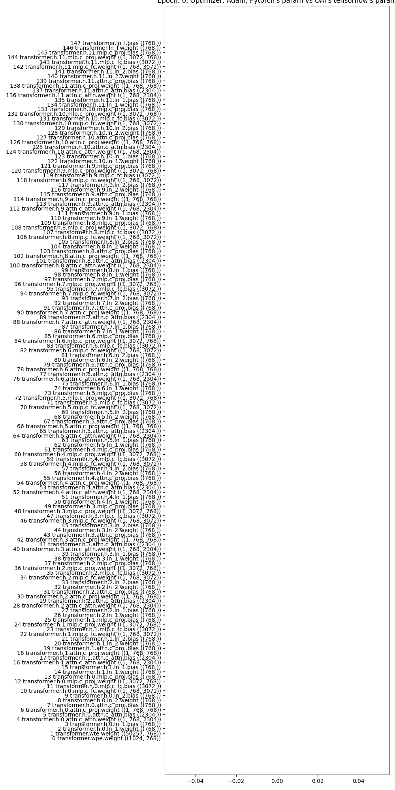
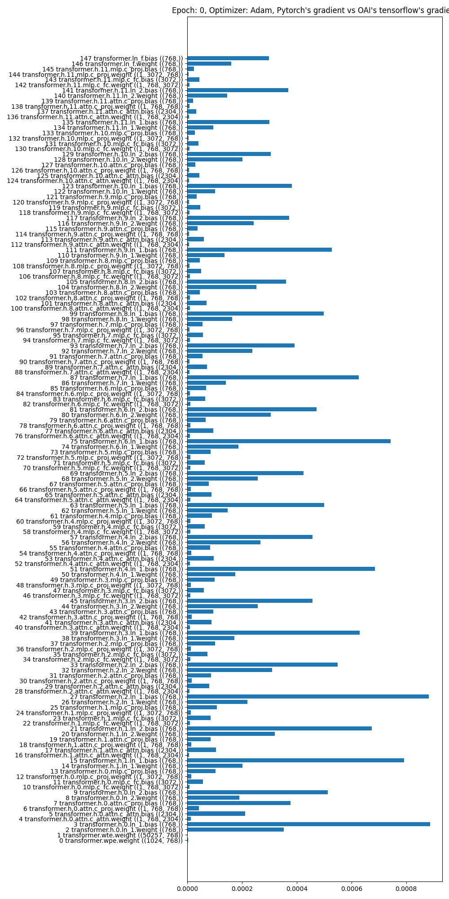
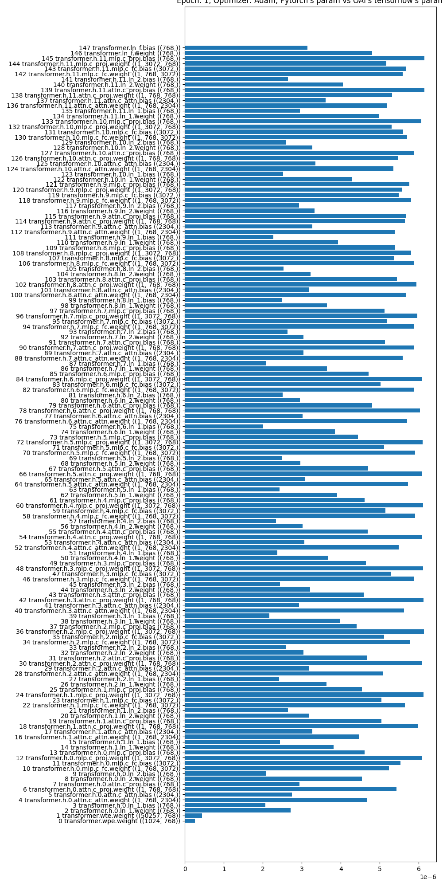
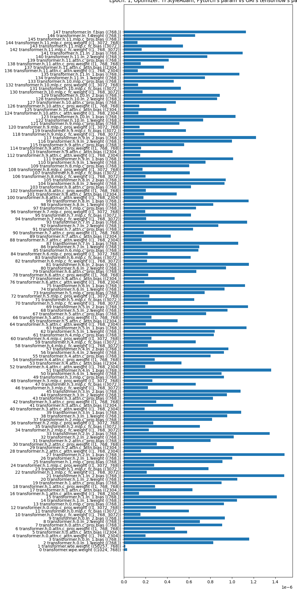

# minimal-adam-difference

This is a minimal repro for early aggresive updates in PyTorch Adam when doing PPO + RLHF. 

**TL;DR.** PyTorch Adam causes an aggresive initial policy update. 

## Setup

I record the original query, response, and rewards from https://github.com/openai/lm-human-preferences and save them in https://huggingface.co/datasets/vwxyzjn/lm-human-preferences-debug/tree/main . I also record the weights and gradeint of the first two epochs of training with Adam and optimizers. 

Here is a table summarizing the files and their contents:

| File | Contents |
| --- | --- |
| `query.npy` | The original query (batch of 64) |
| `response.npy` | The original response (batch of 64) |
| `rewards.npy` | The original rewards (batch of 64) |
| `params_and_grads.pkl` | The params and grads of the first two epochs of training with `tf.train.AdamOptimizer(learning_rate=0.00001, epsilon=1e-5)` |

## Repro

```
poetry install
poetry run python main.py
```

It should output something like below.

```
==================================================
working with Adam: Adam with eps=1e-5
epoch=0, logprobs_diff mean=0.0
epoch=0, logprobs_diff var=0.0
epoch=0, logprobs_diff max=0.0
epoch=0, logprobs_diff min=0.0
epoch=0, ratio mean=1.0
epoch=0, ratio var=0.0
epoch=0, ratio max=1.0
epoch=0, ratio min=1.0
approxkl 0.0 pg_loss 1.2417634032146907e-08 pg_clipfrac 0.0
epoch=1, logprobs_diff mean=0.008101251907646656
epoch=1, logprobs_diff var=0.004668936599045992
epoch=1, logprobs_diff max=0.594489574432373
epoch=1, logprobs_diff min=-0.9134478569030762
epoch=1, ratio mean=1.0105520486831665
epoch=1, ratio var=0.005374275613576174
epoch=1, ratio max=1.8121057748794556
epoch=1, ratio min=0.4011387825012207
approxkl 0.0023672834504395723 pg_loss -0.034187596291303635 pg_clipfrac 0.02018229104578495
==================================================
working with TFStyleAdam: Tensorflow-style Adam with eps=1e-5
epoch=0, logprobs_diff mean=0.0
epoch=0, logprobs_diff var=0.0
epoch=0, logprobs_diff max=0.0
epoch=0, logprobs_diff min=0.0
epoch=0, ratio mean=1.0
epoch=0, ratio var=0.0
epoch=0, ratio max=1.0
epoch=0, ratio min=1.0
approxkl 0.0 pg_loss 1.2417634032146907e-08 pg_clipfrac 0.0
epoch=1, logprobs_diff mean=0.004073789343237877
epoch=1, logprobs_diff var=0.0007334011606872082
epoch=1, logprobs_diff max=0.22331619262695312
epoch=1, logprobs_diff min=-0.31471776962280273
epoch=1, ratio mean=1.0044583082199097
epoch=1, ratio var=0.0007942612282931805
epoch=1, ratio max=1.250215768814087
epoch=1, ratio min=0.7299948930740356
approxkl 0.000374998344341293 pg_loss -0.014567638747394085 pg_clipfrac 0.0052083334885537624
```

**Observation 1**: The `ratio` of the `TFStyleAdam` updates have significantly smaller variance than those of the `Adam` updates. Also, this result in a much smaller `approxkl` and `pg_loss` and `clipfrac` for `SGD` than `Adam`.

What's going on? I plot the parameter difference between `main.py` and `lm-human-preferences` before the training, which shows the parameters are identical.



After the first epoch of update, I then plot the gradient difference between `main.py` and `lm-human-preferences`:



**Observation 2**: Notice how the gradients of the `LayerNorm` parameters are significantly different. This is the root cause of the problem. 

As an example, we print some gradients below. Notice how the first gradient for `h0/ln_1/b:0` is `2.4899011e-05` in OAI's codebase, but `1.8152525e-05` in `main.py`. This is a difference of `0.6746486e-05`, which is quite significant.

In comparison, the gradients of the other layers are much more similar. For example, the first gradient for `h0/attn/c_attn/w:0` is `2.88992633e-05` in OAI's codebase, but `2.88992633e-05` in `main.py`. This is a difference of `0.0`, which is much smaller than the difference in the `LayerNorm` parameters.


```
(Pdb) oname, ograd[:10], name, param.grad.detach().numpy()[:10]
('policy/model/h0/ln_1/b:0', array([ 2.4899011e-05, -1.1588502e-03,  1.7985557e-03,  7.4343453e-03,
       -2.5840786e-03, -3.5906259e-03, -6.6465489e-04,  1.8007826e-03,
       -1.6414827e-03, -6.6386913e-03], dtype=float32), 'transformer.h.0.ln_1.bias', array([ 1.8152525e-05, -1.1576341e-03,  1.7961735e-03,  7.4219629e-03,
       -2.5832835e-03, -3.5855419e-03, -6.7265466e-04,  1.8039590e-03,
       -1.6386800e-03, -6.6277790e-03], dtype=float32))
(Pdb) oname, ograd[:10], name, param.grad.detach().numpy()[:10]
('policy/model/h0/attn/c_attn/w:0', array([[[ 2.88992633e-05, -6.70402551e-06, -1.57610848e-05, ...,
         -1.05873929e-04, -9.40704340e-05,  1.00523466e-04],
        [ 7.87996178e-05, -5.04239551e-07, -8.35032733e-06, ...,
         -4.07231477e-04,  4.93751504e-05, -2.81412737e-04],
        [ 8.21374197e-05, -1.94475469e-05, -1.36382323e-05, ...,
         -1.95847577e-04, -4.09606873e-04,  2.84076581e-04],
        ...,
        [-6.02674390e-06,  4.23970641e-06, -7.39748998e-07, ...,
          1.90844381e-04, -8.59782376e-05, -6.60822116e-05],
        [ 3.50006849e-05, -1.32066066e-06, -3.52823263e-05, ...,
         -1.33828435e-04,  1.01715421e-04,  3.40739585e-04],
        [ 1.05423496e-04, -2.66656862e-05, -4.54609835e-05, ...,
         -4.23200603e-04, -1.64171652e-04,  2.63288792e-04]]],
      dtype=float32), 'transformer.h.0.attn.c_attn.weight', array([[ 2.88245592e-05, -6.68141320e-06, -1.57281083e-05, ...,
        -1.05716754e-04, -9.39845631e-05,  1.00422243e-04],
       [ 7.86117525e-05, -4.96559778e-07, -8.27262829e-06, ...,
        -4.06837964e-04,  4.93464249e-05, -2.81286135e-04],
       [ 8.19143170e-05, -1.94303120e-05, -1.35097052e-05, ...,
        -1.95316272e-04, -4.09374770e-04,  2.83872039e-04],
       ...,
       [-1.33238527e-05, -6.14432452e-08,  7.30297143e-06, ...,
         8.94646073e-05, -1.24311875e-04,  1.05930310e-04],
       [-1.15070456e-04,  1.79788076e-05,  3.04212826e-05, ...,
         6.06048678e-04,  3.23058601e-04, -4.77053138e-04],
       [-5.75132690e-05,  2.93947778e-05,  3.10599062e-05, ...,
         2.26184493e-05,  1.36010476e-05,  9.29407452e-06]], dtype=float32))
```

Then after a gradient pass (i.e., `optimizer.step()`) in `main.py`, I plot the parameter difference between `main.py` and `lm-human-preferences`:



**Observation 3**: Even though the gradient of most layers are similar between pytorch and OAI's codebase, the Adam optimizer causes a significant difference in the parameters. For example, `('transformer.wte.weight', 'policy/model/wte:0')` have near identical gradients as indicated in the last section, but their weights become quite different after a gradient pass.


In comparison, with `TFStyleAdam`, the parameters are much more similar between `main.py` and `lm-human-preferences`:
. Note the scale of the x-axis is 4x smaller than that of `Adam`.
